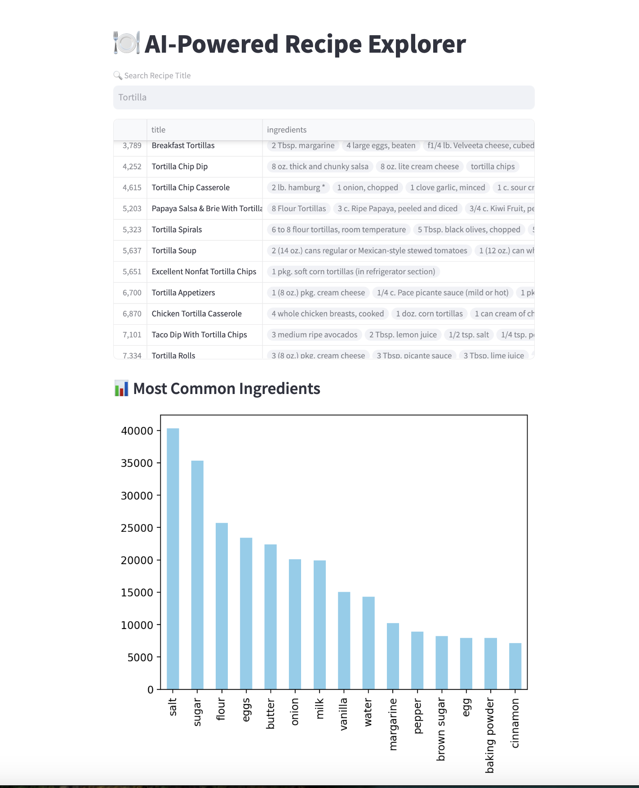

# AI-Powered Recipe Dashboard



**A multi-interface recipe exploration tool** built using **Streamlit, Plotly Dash, and FastAPI**.  
Users can **search, filter, and visualise recipes**, with an AI-powered ingredient-based search feature.

---

## Features

**Streamlit Dashboard**
- Search recipes by **title** 🔍  
- Search recipes by **ingredient** 🥕  
- View **most common ingredients** in a bar chart 📊  

**Plotly Dash Dashboard**
- Interactive **recipe filtering by category** 📂  
- Advanced **ingredient frequency visualisations** 📈  
- Enhanced UI with **search & filtering capabilities**  

**FastAPI Backend**
- **GET `/recipes/`** → Fetch all recipes  
- **GET `/recipes/search/?title=Tortilla`** → Search by title  
- **GET `/recipes/by-ingredient/?ingredient=chicken`** → Search by ingredient  

---

## Tech Stack

| Component      | Technology    |
|---------------|--------------|
| **Frontend**  | Streamlit, Plotly Dash  |
| **Backend**   | FastAPI  |
| **Data Processing** | Pandas  |
| **Deployment** | Streamlit Cloud, Render, Railway |

---

## Installation & Setup

### **1️. Clone the Repository**
```bash
git clone https://github.com/YOUR_GITHUB_USERNAME/ai-recipe-dashboard.git
cd ai-recipe-dashboard
```

### **2️. Create a Virtual Environment**
```bash
python -m venv recipe_dashboard_env
source recipe_dashboard_env/bin/activate  # macOS/Linux
recipe_dashboard_env\Scripts\activate  # Windows
```

### **3️. Install Dependencies**
```bash
pip install -r requirements.txt
```

---

## Running the Applications

### **1️. Run Streamlit (UI Dashboard)**
```bash
streamlit run streamlit_app/app.py
```
**Access at:** `http://localhost:8501/`

### **2️. Run Plotly Dash (Advanced UI)**
```bash
python dash_app.py
```
**Access at:** `http://localhost:8050/`

### **3️⃣ Run FastAPI (Backend)**
```bash
uvicorn fastapi_app:app --reload
```
**Access API Docs at:** `http://127.0.0.1:8000/docs`

---

## Deployment

### **Deploy Streamlit**
1. Push your code to GitHub.
2. Go to **[Streamlit Cloud](https://share.streamlit.io/)** and create a new app.
3. Select `streamlit_app/app.py` as the entry point.
4. Click **Deploy**.

### **Deploy Plotly Dash**
1. Push your code to GitHub.
2. Use **Render or Heroku** for deployment.
3. Add a web service with:
   ```bash
   python dash_app.py
   ```
4. Click **Deploy**.

### **Deploy FastAPI**
#### **Option 1: Railway**
1. Push your code to GitHub.
2. Go to **[Railway](https://railway.app/)** and create a new project.
3. Add FastAPI as a service.
4. Use the start command:
   ```bash
   uvicorn fastapi_app:app --host 0.0.0.0 --port $PORT
   ```
5. Click **Deploy**.

#### **Option 2: Vercel**
1. Install Vercel CLI:
   ```bash
   npm install -g vercel
   ```
2. Run:
   ```bash
   vercel
   ```
3. Follow the setup prompts.

---

## API Endpoints

| Endpoint | Method | Description |
|----------|--------|-------------|
| `/` | `GET` | API status check |
| `/recipes/` | `GET` | Fetch all recipes (paginated) |
| `/recipes/search/?title=Tortilla` | `GET` | Search recipes by title |
| `/recipes/by-ingredient/?ingredient=chicken` | `GET` | Find recipes containing an ingredient |

---

## Future Improvements
 - **AI-powered recipe recommendations**
 - **User-uploaded recipes**
 - **Nutritional analysis**
 - **Live recipe ratings & feedback**  

---

## Contributing
Feel free to **fork this repo, submit pull requests, and suggest features**! 🚀

---

## License
This project is licensed under the MIT License – you are free to use, modify, and distribute it.

